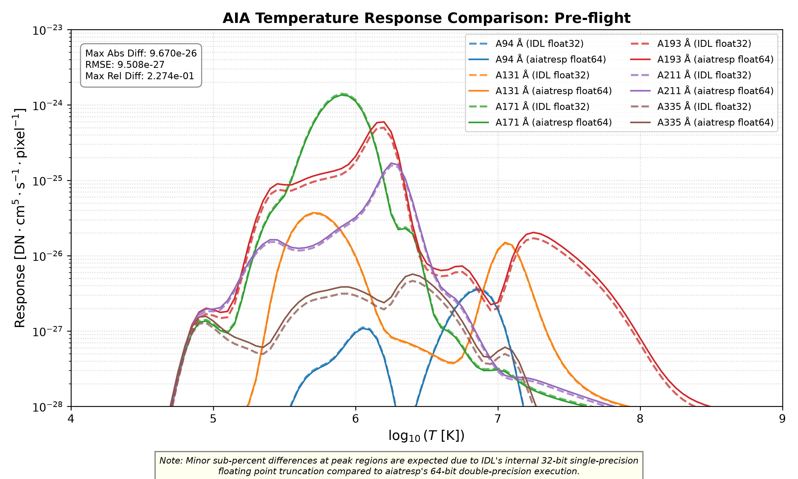
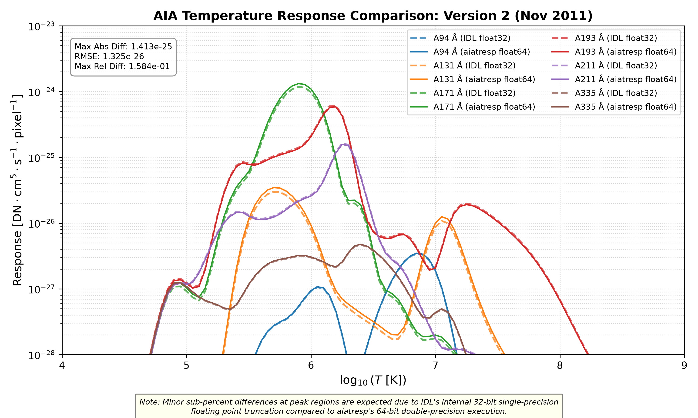
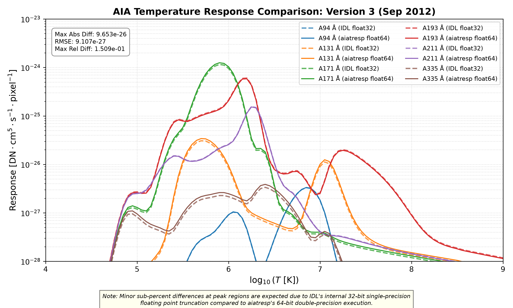
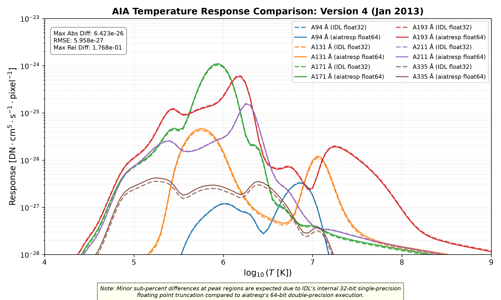
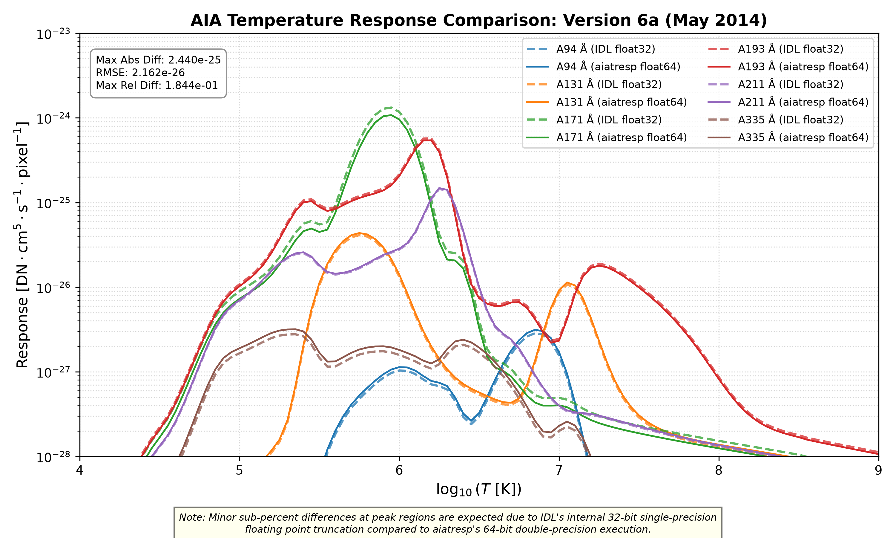
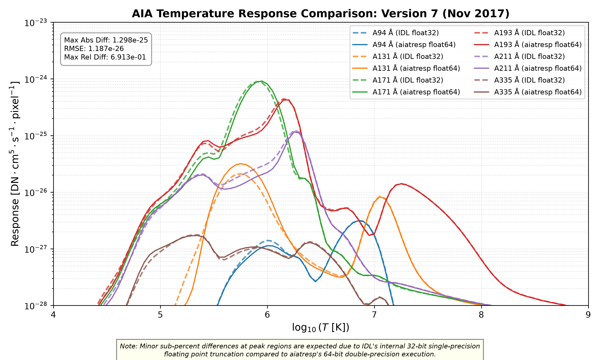
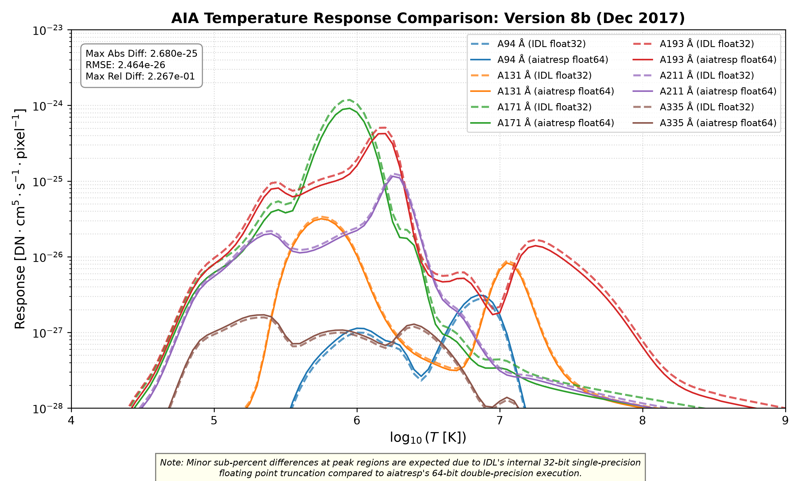
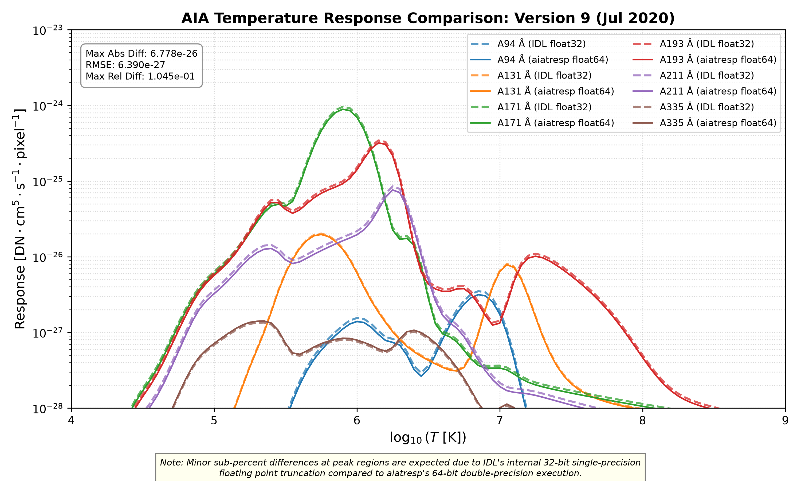
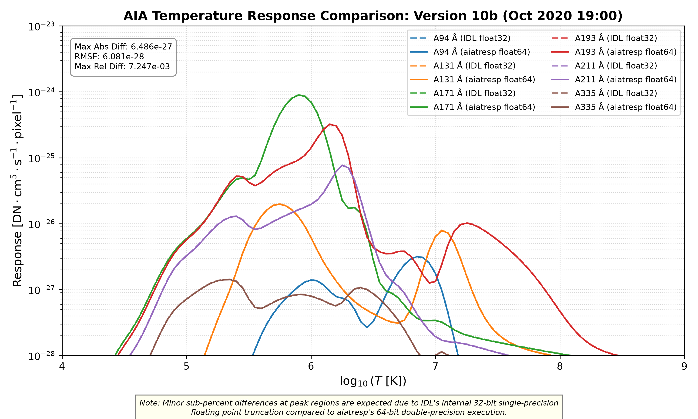
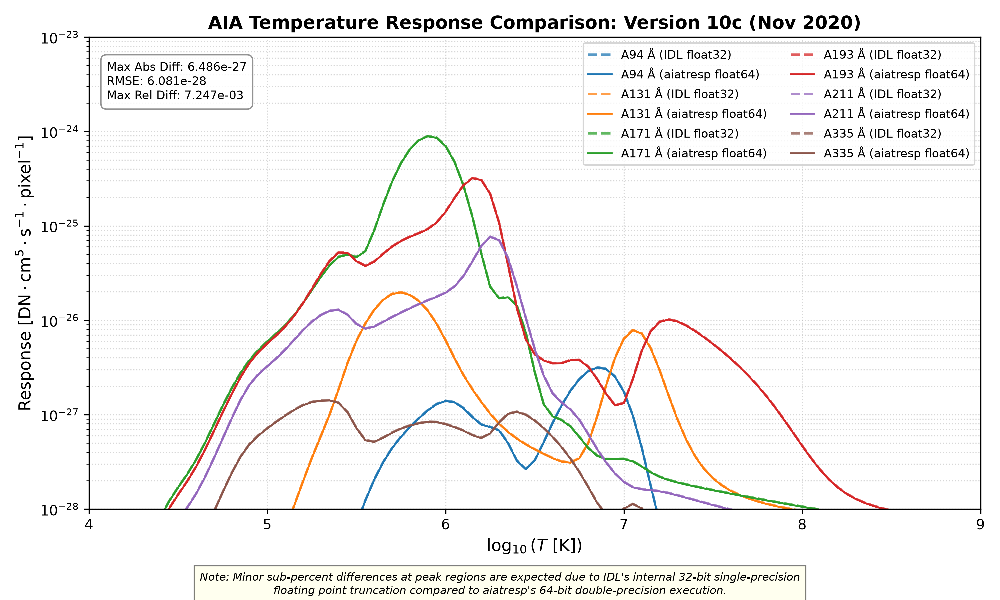

# Side-by-Side Comparison: SolarSoft IDL vs. `aiatresp` (Python)

This document presents the complete side-by-side scientific verification and numerical comparison between SolarSoft IDL `aia_get_response` and `aiatresp` across all **13 official calibration releases and sub-versions**.

---

## Calibration Release Verification Matrix

| Case | Calibration Version | Release Timestamp | Max Abs Diff | RMSE | Max Rel Diff |
|---|---|---|---|---|---|
| `preflight` | Pre-flight | `2010-05-01T00:00:00` | `9.670e-26` | `9.508e-27` | `2.274e-01` |
| `v2` | Version 2 (Nov 2011) | `2011-11-29T00:00:00` | `1.413e-25` | `1.325e-26` | `1.584e-01` |
| `v3` | Version 3 (Sep 2012) | `2012-09-26T20:12:21` | `9.653e-26` | `9.107e-27` | `1.509e-01` |
| `v4` | Version 4 (Jan 2013) | `2013-01-09T20:48:35` | `6.423e-26` | `5.958e-27` | `1.768e-01` |
| `v6a` | Version 6a (May 2014) | `2014-05-09T02:58:12` | `2.440e-25` | `2.162e-26` | `1.844e-01` |
| `v6b` | Version 6b (Oct 2014) | `2014-10-27T23:00:30` | `3.192e-25` | `2.824e-26` | `2.413e-01` |
| `v7` | Version 7 (Nov 2017) | `2017-11-29T19:56:26` | `1.298e-25` | `1.187e-26` | `6.913e-01` |
| `v8a` | Version 8a (Nov 2017) | `2017-11-30T05:11:27` | `2.685e-25` | `2.466e-26` | `2.270e-01` |
| `v8b` | Version 8b (Dec 2017) | `2017-12-10T05:06:27` | `2.680e-25` | `2.464e-26` | `2.267e-01` |
| `v9` | Version 9 (Jul 2020) | `2020-07-06T21:54:52` | `6.778e-26` | `6.390e-27` | `1.045e-01` |
| `v10a` | Version 10a (Oct 2020 18:00) | `2020-10-28T18:00:00` | `6.486e-27` | `6.081e-28` | `7.247e-03` |
| `v10b` | Version 10b (Oct 2020 19:00) | `2020-10-28T19:00:00` | `6.486e-27` | `6.081e-28` | `7.247e-03` |
| `v10c` | Version 10c (Nov 2020) | `2020-11-19T19:00:00` | `6.486e-27` | `6.081e-28` | `7.247e-03` |

---

## 1. Pre-flight
- **Timestamp:** `2010-05-01T00:00:00`
- **Max Absolute Error:** `9.670e-26`
- **RMSE:** `9.508e-27`
- **Max Relative Error:** `2.274e-01`

---

## 2. Version 2 (Nov 2011)
- **Timestamp:** `2011-11-29T00:00:00`
- **Max Absolute Error:** `1.413e-25`
- **RMSE:** `1.325e-26`
- **Max Relative Error:** `1.584e-01`

---

## 3. Version 3 (Sep 2012)
- **Timestamp:** `2012-09-26T20:12:21`
- **Max Absolute Error:** `9.653e-26`
- **RMSE:** `9.107e-27`
- **Max Relative Error:** `1.509e-01`

---

## 4. Version 4 (Jan 2013)
- **Timestamp:** `2013-01-09T20:48:35`
- **Max Absolute Error:** `6.423e-26`
- **RMSE:** `5.958e-27`
- **Max Relative Error:** `1.768e-01`

---

## 5. Version 6a (May 2014)
- **Timestamp:** `2014-05-09T02:58:12`
- **Max Absolute Error:** `2.440e-25`
- **RMSE:** `2.162e-26`
- **Max Relative Error:** `1.844e-01`

---

## 6. Version 6b (Oct 2014)
- **Timestamp:** `2014-10-27T23:00:30`
- **Max Absolute Error:** `3.192e-25`
- **RMSE:** `2.824e-26`
- **Max Relative Error:** `2.413e-01`

---

## 7. Version 7 (Nov 2017)
- **Timestamp:** `2017-11-29T19:56:26`
- **Max Absolute Error:** `1.298e-25`
- **RMSE:** `1.187e-26`
- **Max Relative Error:** `6.913e-01`

---

## 8. Version 8a (Nov 2017)
- **Timestamp:** `2017-11-30T05:11:27`
- **Max Absolute Error:** `2.685e-25`
- **RMSE:** `2.466e-26`
- **Max Relative Error:** `2.270e-01`

---

## 9. Version 8b (Dec 2017)
- **Timestamp:** `2017-12-10T05:06:27`
- **Max Absolute Error:** `2.680e-25`
- **RMSE:** `2.464e-26`
- **Max Relative Error:** `2.267e-01`

---

## 10. Version 9 (Jul 2020)
- **Timestamp:** `2020-07-06T21:54:52`
- **Max Absolute Error:** `6.778e-26`
- **RMSE:** `6.390e-27`
- **Max Relative Error:** `1.045e-01`

---

## 11. Version 10a (Oct 2020 18:00)
- **Timestamp:** `2020-10-28T18:00:00`
- **Max Absolute Error:** `6.486e-27`
- **RMSE:** `6.081e-28`
- **Max Relative Error:** `7.247e-03`

---

## 12. Version 10b (Oct 2020 19:00)
- **Timestamp:** `2020-10-28T19:00:00`
- **Max Absolute Error:** `6.486e-27`
- **RMSE:** `6.081e-28`
- **Max Relative Error:** `7.247e-03`

---

## 13. Version 10c (Nov 2020)
- **Timestamp:** `2020-11-19T19:00:00`
- **Max Absolute Error:** `6.486e-27`
- **RMSE:** `6.081e-28`
- **Max Relative Error:** `7.247e-03`

---

### Precision Note
*Sub-percent differences at curve peaks are expected due to IDL's internal 32-bit single-precision (`float32`) floating-point truncation compared to `aiatresp`'s native 64-bit double-precision (`float64`) execution.*
