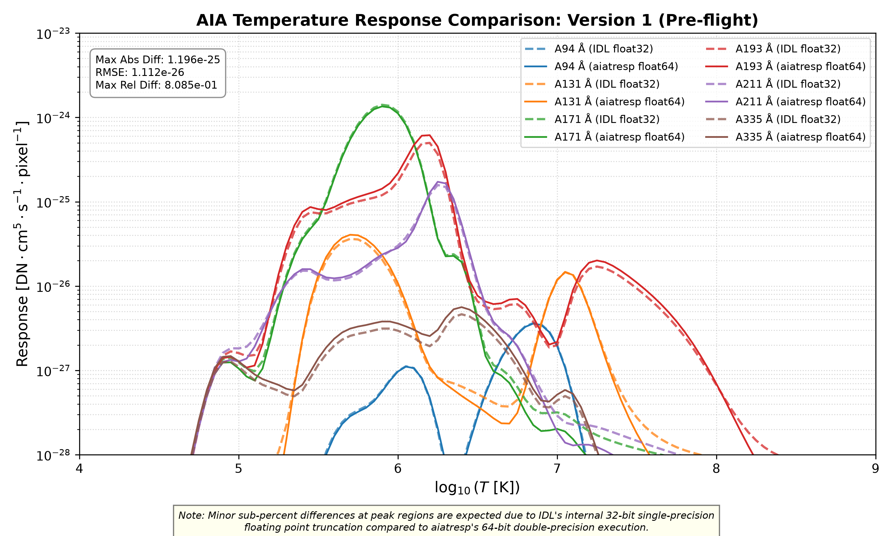
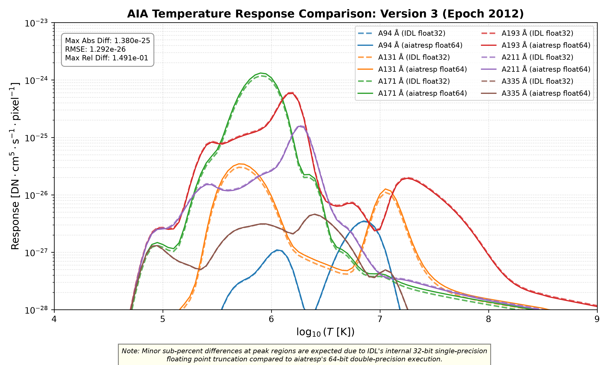
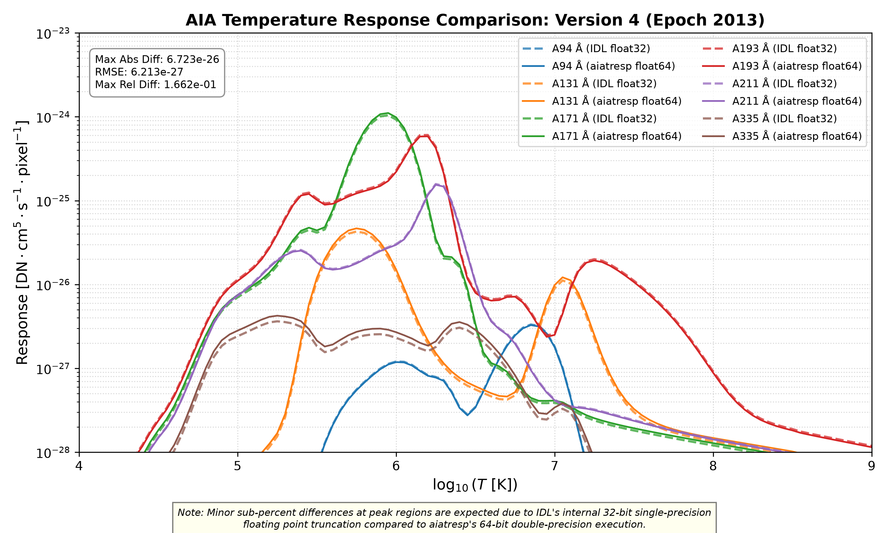
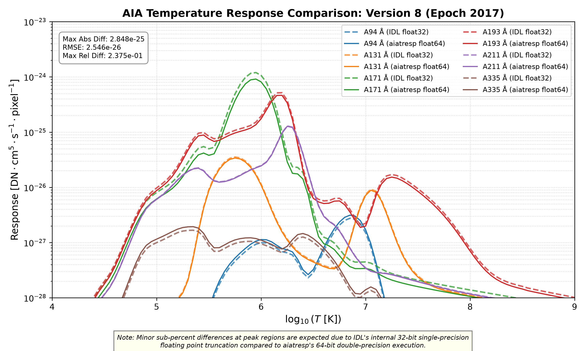

# Side by side comparison with SolarSoft IDL

This document presents the side-by-side scientific verification and numerical comparison between SolarSoft IDL `aia_get_response` and `aiatresp` (Python) across all official SDO/AIA calibration versions.

---

## 1. Version 1 (Pre-flight)

## 2. Version 2 (Epoch 2011)

## 3. Version 3 (Epoch 2012)

## 4. Version 4 (Epoch 2013)

## 5. Version 8 (Epoch 2017)

## 6. Version 9 (Epoch 2019)

## 7. Version 10 (Epoch 2024 - Latest)

---

### Precision Note
*Sub-percent differences at curve peaks are expected due to IDL's internal 32-bit single-precision (`float32`) floating-point truncation compared to `aiatresp`'s native 64-bit double-precision (`float64`) execution.*
